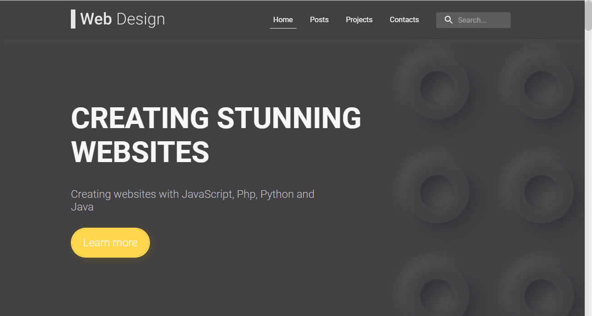
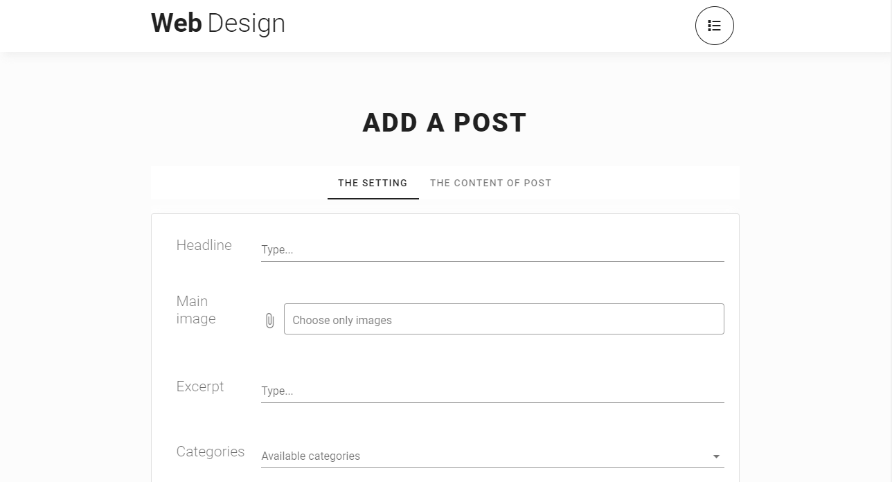
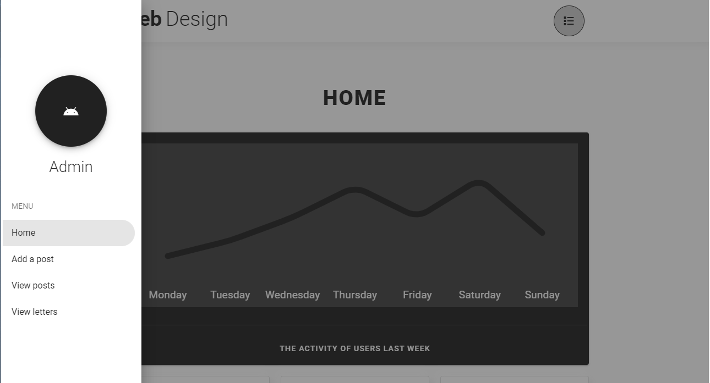
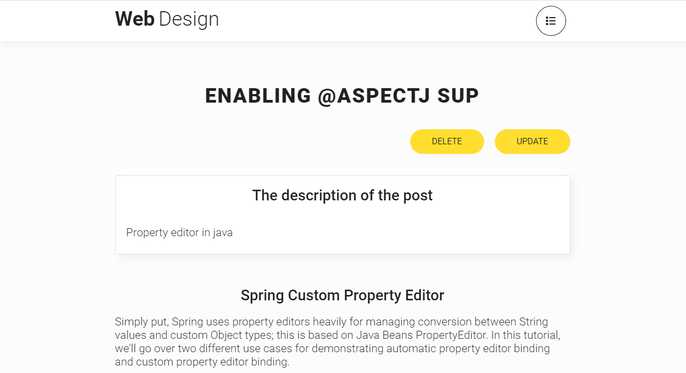

# Java Spring Application

## Technologies
* React (the project is located in the folder, named `src/webapp/react`)
* Vue (the project is located in the folder, named `src/webapp/vue`)
* Redux
* Redux Form
* Scss
* Java Spring
* Hibernate

> WebDesign

> Admin panel

## How to run the app
In the terminal, type the following:
* `npm install`
* `npm run watch` 
In addition, you need to create tables, which correspond with entities, located in src/main/java/models. Also you should fill out the file, named  `src/main/resources/db.properties`. 
Then run the tomcat server. If you don't want to install tomcat and only view static website, you should
run the command `node server.js` and open browser on `http://localhost:4200`

`Warning! In order to run the app properly, tomcat server must be installed`
